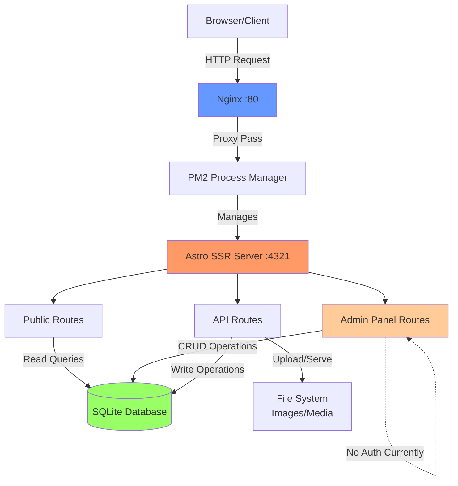
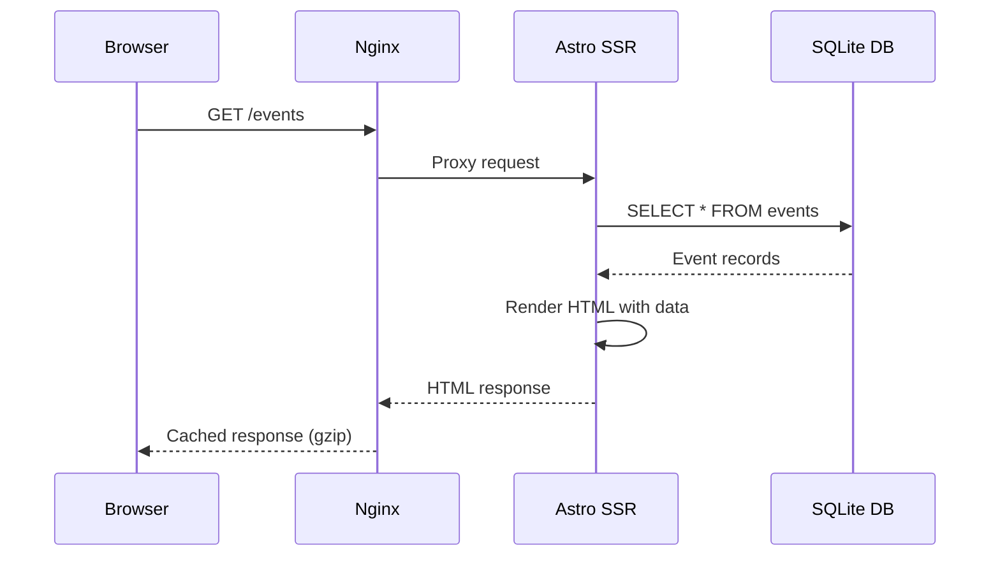
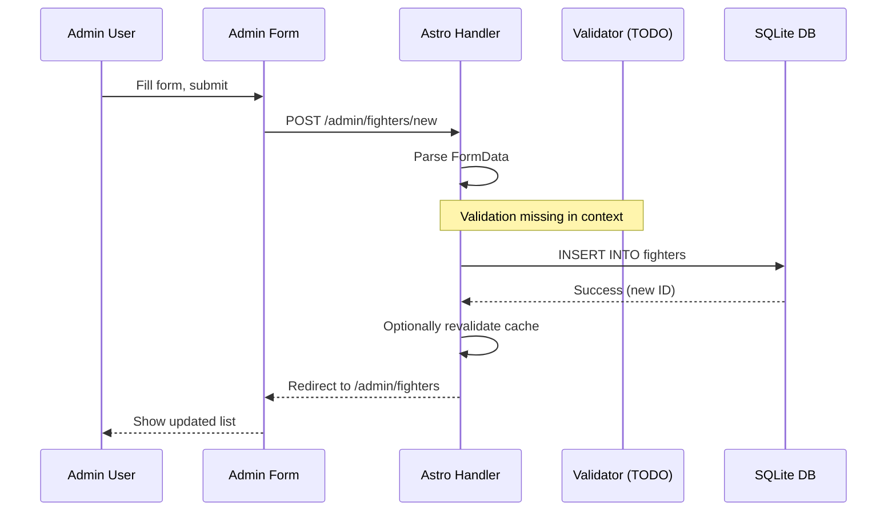
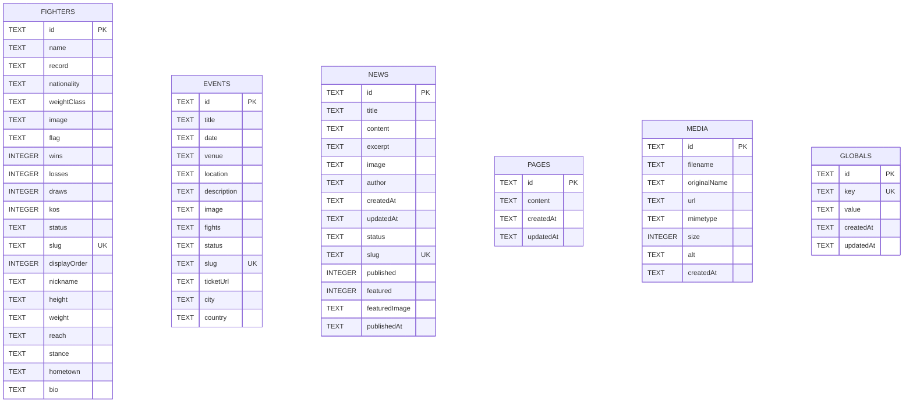
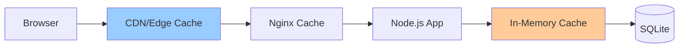

# BiYu Boxing Website - Project Architecture Guide

## 1. Executive Overview

BiYu Promotions is a professional boxing promotion company website built with Astro 5.x (SSR mode), TypeScript/JavaScript, and SQLite. The platform features a public-facing website showcasing fighters, events, and news, plus a custom CMS-style admin panel for content management. The application runs on Ubuntu 24.04 with Node.js v22.11.0, served via PM2 process manager behind an Nginx reverse proxy. Production deployment is at `biyuboxing.com` (69.87.219.106), with a staging environment running concurrently on the same server.

**Key Modules:**
- Public website (SSR pages for SEO)
- Admin panel (content management for fighters, events, news, pages)
- SQLite database layer with better-sqlite3
- Static asset optimization (images, CSS, JS)
- API routes for form submissions and media uploads

**Deployment Footprint:**
- Ubuntu 24.04 LTS (Linux 6.8.0-85-generic x86_64)
- Node.js v22.11.0, npm v11.4.1
- PM2 for process management (production on port 4321, staging on port 3002)
- Nginx reverse proxy with gzip, caching, security headers
- SQLite database at `/var/www/biyuboxing/database/biyuboxing.db`

---

## 2. High-Level Architecture



### Request Lifecycle

**SSR Flow (Server-Side Rendering):**
1. Browser requests page (e.g., `/fighters`)
2. Nginx proxies request to Astro Node.js server (port 4321)
3. Astro executes page component's frontmatter script
4. Data fetched from SQLite via `better-sqlite3`
5. HTML rendered server-side with data injected
6. Response sent to browser with full HTML
7. Client-side JS hydrates interactive components (if any)

**CSR/Islands Usage:**
- **Minimal client-side JavaScript:** Astro's zero-JS-by-default philosophy
- **React integration** available via `@astrojs/react` for future interactive components
- **Animation scripts:** `/src/scripts/animations.js` runs client-side for scroll animations

**Data Flow:**


---

## 3. Runtime & Build

### Versions
- **Node.js:** v22.11.0
- **npm:** v11.4.1
- **OS:** Ubuntu 24.04.3 LTS (Noble), Kernel 6.8.0-85-generic
- **Astro:** ^5.13.5
- **better-sqlite3:** ^9.6.0

### Build Configuration

**File:** `astro.config.mjs`

```javascript
// Key settings
{
  output: 'server',                    // SSR mode (no static generation)
  adapter: node({ mode: 'standalone' }),
  site: 'https://biyuboxing.com',

  server: {
    host: '0.0.0.0',                   // Listen on all interfaces
    port: 4321                         // Default production port
  },

  build: {
    assets: 'assets',                  // Asset output directory
    inlineStylesheets: 'auto'          // Inline small CSS
  },

  image: {
    domains: ['biyuboxing.com'],
    remotePatterns: [{ protocol: 'https' }]
  },

  prefetch: {
    prefetchAll: true,                 // Aggressive prefetching
    defaultStrategy: 'hover'           // Prefetch on link hover
  },

  compressHTML: true,                  // Minify HTML output

  vite: {
    build: {
      cssMinify: 'lightningcss',       // Fast CSS minification
      rollupOptions: {
        output: {
          manualChunks: {              // Code splitting
            'astro': ['astro'],
            'framework': ['@astrojs/internal-helpers']
          }
        }
      }
    }
  }
}
```

### Build Commands

```bash
# Development (hot reload, port 4321)
npm run dev

# Production build
npm run build
# Outputs to: /var/www/biyuboxing/dist/

# Start production server
npm run start
# Equivalent to: node ./dist/server/entry.mjs
```

### Build vs Runtime

**At Build Time:**
- Astro compiles `.astro` components to JavaScript
- Vite bundles and minifies client assets (_astro/*.js, *.css)
- Static assets copied from `public/` to `dist/client/`
- TypeScript transpilation (if present, but project uses `.js` files)
- Image optimization prep (Sharp integration)

**At Runtime (SSR):**
- Every page request executes server-side component logic
- Database queries run per-request (no static prerendering except static routes)
- HTML generated dynamically with fresh data
- `prerender: false` explicitly set on all dynamic pages

**Notable Config Flags:**
- `output: 'server'` – Forces SSR for all routes[^1]
- `prefetchAll: true` – Improves navigation speed via link prefetching[^2]
- `compressHTML: true` – Reduces HTML payload size[^3]

---

## 4. Routing & Pages

### Public Routes

| Path | File | Layout | Data Source | Auth Guard | SEO Notes |
|------|------|--------|-------------|------------|-----------|
| `/` | `src/pages/index.astro` | `Layout.astro` | `getAllNews()`, `getPage('home')` | None | Structured data (Organization schema), meta keywords |
| `/about-us` | `src/pages/about-us/index.astro` | `Layout.astro` | Static content | None | Standard meta tags |
| `/box-for-us` | `src/pages/box-for-us/index.astro` | `Layout.astro` | `getPage('box-for-us')` | None | Application form page |
| `/events` | `src/pages/events/index.astro` | `Layout.astro` | `getAllEvents()` (status='upcoming') | None | Event listings |
| `/events/previous` | `src/pages/events/previous/index.astro` | `Layout.astro` | `getAllEvents()` (status='completed') | None | Past events archive |
| `/fighters` | `src/pages/fighters/index.astro` | `Layout.astro` | `getAllFighters()` | None | Roster page with cards |
| `/fighters/[slug]` | `src/pages/fighters/[slug].astro` | `Layout.astro` | `getFighterBySlug(slug)` | None | Dynamic fighter profiles |
| `/news` | `src/pages/news/index.astro` | `Layout.astro` | `getAllNews()` (published=1) | None | News article listings |
| `/news/[slug]` | `src/pages/news/[slug].astro` | `Layout.astro` | `getNewsBySlug(slug)` | None | Article detail with Open Graph |
| `/contact-us` | `src/pages/contact-us/index.astro` | `Layout.astro` | Static form | None | Contact form |
| `/404` | `src/pages/404.astro` | `Layout.astro` | Static | None | Custom 404 page |
| `/robots.txt` | `src/pages/robots.txt.ts` | None | Generated | None | SEO crawl rules |
| `/sitemap.xml` | `src/pages/sitemap.xml.ts` | None | Generated from routes | None | XML sitemap |

### Admin Routes (No Authentication Currently)

| Path | File | Purpose |
|------|------|---------|
| `/admin` | `src/pages/admin/index.astro` | Redirects to dashboard |
| `/admin/dashboard` | `src/pages/admin/dashboard.astro` | Admin homepage with stats |
| `/admin/login` | `src/pages/admin/login.astro` | Login form (placeholder) |
| `/admin/events` | `src/pages/admin/events.astro` | Event list/CRUD |
| `/admin/events/new` | `src/pages/admin/events/new.astro` | Create event form |
| `/admin/events/edit/[id]` | `src/pages/admin/events/edit/[id].astro` | Edit event form |
| `/admin/fighters` | `src/pages/admin/fighters.astro` | Fighter list/CRUD |
| `/admin/fighters/new` | `src/pages/admin/fighters/new.astro` | Create fighter form |
| `/admin/fighters/edit/[id]` | `src/pages/admin/fighters/edit/[id].astro` | Edit fighter form |
| `/admin/news` | `src/pages/admin/news.astro` | News list/CRUD |
| `/admin/news/new` | `src/pages/admin/news/new.astro` | Create article form |
| `/admin/news/edit/[id]` | `src/pages/admin/news/edit/[id].astro` | Edit article form |
| `/admin/pages/*` | `src/pages/admin/pages/*.astro` | CMS page editors (home, about, etc.) |
| `/admin/media` | `src/pages/admin/media.astro` | Media library |
| `/admin/globals/*` | `src/pages/admin/globals/*.astro` | Global settings editors |

### API Routes

| Method | Path | Handler | Purpose | Request Schema | Response |
|--------|------|---------|---------|----------------|----------|
| POST/GET | `/api/fighters` | `src/pages/api/fighters.js` | CRUD fighters | Unknown in context | JSON |
| POST/GET | `/api/events` | `src/pages/api/events.js` | CRUD events | Unknown in context | JSON |
| POST | `/api/submit-application` | `src/pages/api/submit-application.js` | Fighter application form | Unknown in context | JSON |
| POST | `/api/vip-signup` | `src/pages/api/vip-signup.js` | VIP mailing list | Unknown in context | JSON |
| POST | `/api/media/upload` | `src/pages/api/media/upload.js` | File upload | Multipart form | JSON (file path) |
| GET | `/api/media` | `src/pages/api/media/index.js` | List uploaded media | None | JSON array |
| POST | `/api/auth/logout` | `src/pages/api/auth/logout.js` | Logout (placeholder) | None | JSON |

**TODO:** Document API request/response schemas with TypeScript interfaces.

### Astro Pages & Islands

**Pages** (`src/pages/*.astro`):
- Top-level route components
- Execute server-side frontmatter (`---` blocks) for data fetching
- Use `Layout.astro` wrapper for consistent structure
- Export `prerender = false` to force SSR per-request

**Components** (`src/components/*.astro`):
- Reusable UI blocks (Header, Footer, FighterCard, etc.)
- No client-side state by default (static HTML)
- Can import React components for interactivity (none currently used)

**Layouts** (`src/layouts/Layout.astro`):
- Wraps all pages with `<html>`, `<head>`, `<body>`
- Imports global CSS (`global.css`, `biyu.css`, etc.)
- Injects SEO component and structured data

---

## 5. Components Inventory

### Core UI Components

**File:** `src/components/sections/Header.astro`
- **Purpose:** Site navigation bar
- **Props:** None
- **Data Dependencies:** None (static links)
- **Used In:** All public pages via `Layout.astro`

**File:** `src/components/sections/Footer.astro`
- **Purpose:** Site footer with links, social media
- **Props:** None
- **Data Dependencies:** None
- **Used In:** All public pages via `Layout.astro`

**File:** `src/components/sections/UpcomingEvent.astro`
- **Purpose:** Display upcoming events on homepage
- **Props:** None
- **Data Dependencies:** `getAllEvents()` – filters `status='upcoming'`, sorts by date
- **Used In:** `src/pages/index.astro`
- **Styling:** Custom `.upcoming-events-section` with hexagonal background pattern

**File:** `src/components/ui/FighterCard.astro`
- **Purpose:** Fighter profile card with image, record, stats
- **Props:**
  ```typescript
  interface Props {
    name: string;
    image?: string;
    record?: string;
    nationality?: string;
    slug?: string;
  }
  ```
- **Data Dependencies:** None (receives data as props)
- **Used In:** `src/pages/fighters/index.astro`

**File:** `src/components/ui/NewsCard.astro`
- **Purpose:** News article teaser card
- **Props:**
  ```typescript
  interface Props {
    title: string;
    excerpt?: string;
    image?: string;
    slug?: string;
    publishedAt?: Date;
  }
  ```
- **Data Dependencies:** None
- **Used In:** `src/pages/news/index.astro`

**File:** `src/components/ContactForm.astro`
- **Purpose:** Contact form with validation
- **Props:** None
- **Data Dependencies:** Submits to unknown API endpoint (TODO: verify)
- **Used In:** `src/pages/contact-us/index.astro`

**File:** `src/components/SEO.astro`
- **Purpose:** SEO meta tags, Open Graph, Twitter Cards
- **Props:**
  ```typescript
  interface Props {
    title?: string;
    description?: string;
    image?: string;
    canonical?: string;
    noindex?: boolean;
    article?: {
      publishedTime: string;
      modifiedTime?: string;
      author?: string;
      section?: string;
    };
    type?: 'article' | 'website';
  }
  ```
- **Used In:** `Layout.astro` (all pages)

### Admin Components

**File:** `src/components/admin/AdminLayout.astro`
- **Purpose:** Admin panel wrapper layout
- **Props:** `{ pageTitle: string }`
- **Used In:** All admin pages

**File:** `src/components/admin/MediaSelector.astro`
- **Purpose:** File picker component for admin forms
- **Props:**
  ```typescript
  interface Props {
    inputName: string;
    inputId: string;
    mediaType?: 'image' | 'video' | 'document';
    initialValue?: string;
  }
  ```
- **Used In:** Admin page editors (home, box-for-us, etc.)

### State Management

**Approach:** No global state management library. All state is:
- **Server-side:** Fresh database queries per request
- **Client-side:** Minimal – DOM manipulation via vanilla JS in `animations.js`
- **Future React components:** Could use hooks for local state

---

## 6. Admin Panel Architecture

### Navigation Map

```
/admin
├── Dashboard (stats overview)
├── Events
│   ├── List all events
│   ├── Create new event
│   └── Edit event by ID
├── Fighters
│   ├── List all fighters
│   ├── Create new fighter
│   └── Edit fighter by ID
├── News
│   ├── List all articles
│   ├── Create new article
│   └── Edit article by ID
├── Pages (CMS editors)
│   ├── Home
│   ├── About Us
│   ├── Box For Us
│   ├── Contact Us
│   ├── Upcoming Events
│   ├── Previous Events
│   ├── News Listing
│   └── 404
├── Media Library
│   └── Upload/manage images
└── Globals
    └── VIP Signup settings
```

### Role/Permission Model

**Current State:** **No authentication or authorization implemented.**

**File:** `src/lib/auth.js`
```javascript
// All functions return false/null – placeholder implementation
export function verifyToken(token) { return false; }
export function validateCredentials(username, password) { return false; }
// ... etc.
```

**Security Implication:** Admin panel is **publicly accessible** – CRITICAL VULNERABILITY.

**Proposed Minimal RBAC:**

```typescript
// src/lib/auth.ts (future implementation)
interface User {
  id: string;
  username: string;
  role: 'admin' | 'editor' | 'viewer';
}

interface Permission {
  resource: 'fighters' | 'events' | 'news' | 'pages' | 'media';
  action: 'create' | 'read' | 'update' | 'delete';
}

const rolePermissions: Record<string, Permission[]> = {
  admin: [/* all permissions */],
  editor: [
    { resource: 'fighters', action: 'update' },
    { resource: 'news', action: 'create' },
    // ... read/update only
  ],
  viewer: [
    { resource: '*', action: 'read' }
  ]
};

function checkPermission(user: User, permission: Permission): boolean {
  return rolePermissions[user.role].some(p =>
    (p.resource === permission.resource || p.resource === '*') &&
    (p.action === permission.action || p.action === '*')
  );
}
```

**Recommended Implementation:**
1. Add `users` table to SQLite with hashed passwords (bcrypt)
2. Implement session cookies with `httpOnly`, `secure`, `sameSite: 'strict'`
3. Create middleware to check session on all `/admin/*` routes
4. Add CSRF tokens to forms

### Data Operations Supported

**CRUD Matrix:**

| Resource | Create | Read | Update | Delete |
|----------|--------|------|--------|--------|
| Fighters | ✓ `/admin/fighters/new` | ✓ List/Detail | ✓ `/admin/fighters/edit/[id]` | ✓ (unknown route) |
| Events | ✓ `/admin/events/new` | ✓ List/Detail | ✓ `/admin/events/edit/[id]` | ✓ (unknown route) |
| News | ✓ `/admin/news/new` | ✓ List/Detail | ✓ `/admin/news/edit/[id]` | ✓ (unknown route) |
| Pages | - | ✓ | ✓ `/admin/pages/*` | - |
| Media | ✓ `/api/media/upload` | ✓ `/api/media` | - | Unknown |

**Validation Strategy:** Unknown in context (TODO: check admin form handlers for validation logic).

### Admin Action Flow (Create Record Example)



---

## 7. Data Model & Persistence

### Entity-Relationship Diagram



### DDL (Schema)

**Database File:** `/var/www/biyuboxing/database/biyuboxing.db`

```sql
-- Fighters Table
CREATE TABLE fighters (
    id TEXT PRIMARY KEY,
    name TEXT NOT NULL,
    record TEXT,
    nationality TEXT,
    weightClass TEXT,
    image TEXT,
    flag TEXT,
    wins INTEGER DEFAULT 0,
    losses INTEGER DEFAULT 0,
    draws INTEGER DEFAULT 0,
    kos INTEGER DEFAULT 0,
    status TEXT DEFAULT 'active',
    slug TEXT UNIQUE,
    displayOrder INTEGER DEFAULT 0,
    nickname TEXT,
    height TEXT,
    weight TEXT,
    reach TEXT,
    stance TEXT,
    hometown TEXT,
    bio TEXT
);

-- Events Table
CREATE TABLE events (
    id TEXT PRIMARY KEY,
    title TEXT NOT NULL,
    date TEXT,
    venue TEXT,
    location TEXT,
    description TEXT,
    image TEXT,
    fights TEXT,  -- JSON-encoded array
    status TEXT DEFAULT 'upcoming',
    slug TEXT UNIQUE,
    ticketUrl TEXT,
    city TEXT,
    country TEXT
);

-- News Table
CREATE TABLE news (
    id TEXT PRIMARY KEY,
    title TEXT NOT NULL,
    content TEXT,
    excerpt TEXT,
    image TEXT,
    author TEXT,
    createdAt TEXT,
    updatedAt TEXT,
    status TEXT DEFAULT 'published',
    slug TEXT UNIQUE,
    published INTEGER DEFAULT 1,
    featured INTEGER DEFAULT 0,
    featuredImage TEXT,
    publishedAt TEXT
);

-- Pages Table (CMS content storage)
CREATE TABLE pages (
    id TEXT PRIMARY KEY,
    content TEXT,  -- JSON-encoded page fields
    createdAt TEXT NOT NULL,
    updatedAt TEXT NOT NULL
);

-- Media Table (file uploads)
CREATE TABLE media (
    id TEXT PRIMARY KEY,
    filename TEXT NOT NULL,
    originalName TEXT NOT NULL,
    url TEXT NOT NULL,
    mimetype TEXT,
    size INTEGER,
    alt TEXT,
    createdAt TEXT NOT NULL
);

-- Globals Table (site-wide settings)
CREATE TABLE globals (
    id TEXT PRIMARY KEY,
    key TEXT UNIQUE NOT NULL,
    value TEXT,
    createdAt TEXT NOT NULL,
    updatedAt TEXT NOT NULL
);
```

### Indexes & Query Optimization

**Existing Indexes:**
- `UNIQUE` constraints on `slug` fields (auto-creates index)
- Primary keys (auto-indexed)

**Hot Queries:**
1. `SELECT * FROM fighters WHERE slug = ?` (index exists: `slug UNIQUE`)
2. `SELECT * FROM news WHERE published = 1 ORDER BY featured DESC, publishedAt DESC`
3. `SELECT * FROM events WHERE status = 'upcoming' ORDER BY date ASC`

**Missing Indexes (Proposed):**

```sql
-- Optimize news listing query
CREATE INDEX idx_news_published_featured
ON news(published, featured, publishedAt DESC);

-- Optimize event filtering
CREATE INDEX idx_events_status_date
ON events(status, date);

-- Optimize fighter ordering
CREATE INDEX idx_fighters_displayorder
ON fighters(displayOrder, name);
```

**Justification:**
- `idx_news_published_featured`: Covers `WHERE published=1` filter + `ORDER BY featured, publishedAt` sort
- `idx_events_status_date`: Supports filtering by status ('upcoming'/'completed') + date sorting
- `idx_fighters_displayorder`: Admin may sort fighters by custom order

### Migration Strategy

**Current Approach:** **Manual schema changes via SQL scripts** (no migration framework detected).

**Pragmatic Migration Proposal:**

1. **Create migrations directory:** `database/migrations/`
2. **Naming convention:** `YYYYMMDD_HHMMSS_description.sql`
   ```sql
   -- database/migrations/20251003_120000_add_indexes.sql
   CREATE INDEX IF NOT EXISTS idx_news_published_featured
   ON news(published, featured, publishedAt DESC);
   ```
3. **Migration runner script:**
   ```javascript
   // scripts/migrate.js
   import Database from 'better-sqlite3';
   import fs from 'fs';
   import path from 'path';

   const db = new Database('/var/www/biyuboxing/database/biyuboxing.db');
   const migrationsDir = 'database/migrations';

   // Track applied migrations
   db.exec(`
     CREATE TABLE IF NOT EXISTS migrations (
       id TEXT PRIMARY KEY,
       applied_at TEXT NOT NULL
     )
   `);

   const files = fs.readdirSync(migrationsDir).sort();
   const applied = new Set(
     db.prepare('SELECT id FROM migrations').all().map(r => r.id)
   );

   for (const file of files) {
     if (!applied.has(file)) {
       console.log(`Applying migration: ${file}`);
       const sql = fs.readFileSync(path.join(migrationsDir, file), 'utf8');
       db.exec(sql);
       db.prepare('INSERT INTO migrations (id, applied_at) VALUES (?, ?)').run(
         file,
         new Date().toISOString()
       );
     }
   }
   ```

### Backups & Maintenance

**Backup Strategy:**

```bash
# Automated backup script (cron daily at 2am)
#!/bin/bash
# /var/www/biyuboxing/scripts/backup-db.sh

BACKUP_DIR="/var/www/biyuboxing/database/backups"
DB_PATH="/var/www/biyuboxing/database/biyuboxing.db"
TIMESTAMP=$(date +%Y%m%d_%H%M%S)

mkdir -p "$BACKUP_DIR"
sqlite3 "$DB_PATH" ".backup '$BACKUP_DIR/biyuboxing_$TIMESTAMP.db'"

# Keep only last 30 days
find "$BACKUP_DIR" -name "biyuboxing_*.db" -mtime +30 -delete
```

**Crontab entry:**
```cron
0 2 * * * /var/www/biyuboxing/scripts/backup-db.sh >> /var/log/biyuboxing-backup.log 2>&1
```

**SQLite PRAGMA Settings (Production):**

```javascript
// src/lib/database.js
export function connectToDatabase() {
  if (db) return db;

  db = new Database(DB_PATH);

  // Performance tuning
  db.pragma('journal_mode = WAL');        // Write-Ahead Logging (better concurrency)
  db.pragma('synchronous = NORMAL');      // Balance safety/speed
  db.pragma('cache_size = -64000');       // 64MB cache
  db.pragma('temp_store = MEMORY');       // Use RAM for temp tables
  db.pragma('mmap_size = 268435456');     // 256MB memory-mapped I/O

  // Integrity check on startup
  const result = db.pragma('integrity_check');
  if (result[0].integrity_check !== 'ok') {
    throw new Error('Database integrity check failed!');
  }

  return db;
}
```

**VACUUM Schedule:**
```bash
# Monthly vacuum (systemd timer or cron)
0 3 1 * * sqlite3 /var/www/biyuboxing/database/biyuboxing.db "VACUUM;"
```

**Docs Citations Required:**
- SQLite PRAGMA documentation for WAL mode, synchronous settings
- better-sqlite3 performance tuning guide

---

## 8. Data Access Layer

### Query Execution

**Library:** `better-sqlite3` (v9.6.0)[^4]

**Pattern:** Direct SQL with prepared statements (no ORM).

**File:** `src/lib/database.js`

### Repository Functions

```typescript
// src/lib/database.js (annotated with types)

/**
 * Get all events, sorted by date descending
 * @returns {Array<Event>}
 */
export function getAllEvents(): Event[] {
  const db = connectToDatabase();
  const events = db.prepare('SELECT * FROM events ORDER BY date DESC').all();

  return events.map(event => ({
    ...event,
    fights: event.fights ? JSON.parse(event.fights) : [],
    date: event.date ? new Date(event.date) : null
  }));
}

/**
 * Get news articles, prioritizing featured, sorted by publish date
 * @returns {Array<NewsArticle>}
 */
export function getAllNews(): NewsArticle[] {
  const db = connectToDatabase();
  const news = db.prepare(
    'SELECT * FROM news ORDER BY featured DESC, publishedAt DESC'
  ).all();

  return news.map(article => ({
    ...article,
    published: Boolean(article.published),
    featured: Boolean(article.featured),
    publishedAt: article.publishedAt ? new Date(article.publishedAt) : null,
    createdAt: article.createdAt ? new Date(article.createdAt) : null,
    updatedAt: article.updatedAt ? new Date(article.updatedAt) : null
  }));
}

/**
 * Get single fighter by slug
 * @param {string} slug - URL-friendly identifier
 * @returns {Fighter|null}
 */
export function getFighterBySlug(slug: string): Fighter | null {
  const db = connectToDatabase();
  return db.prepare('SELECT * FROM fighters WHERE slug = ?').get(slug);
}

/**
 * Get single news article by slug
 * @param {string} slug
 * @returns {NewsArticle|null}
 */
export function getNewsBySlug(slug: string): NewsArticle | null {
  const db = connectToDatabase();
  return db.prepare('SELECT * FROM news WHERE slug = ?').get(slug);
}

/**
 * Get single event by slug
 * @param {string} slug
 * @returns {Event|null}
 */
export function getEventBySlug(slug: string): Event | null {
  const db = connectToDatabase();
  const event = db.prepare('SELECT * FROM events WHERE slug = ?').get(slug);
  if (event?.fights) {
    event.fights = JSON.parse(event.fights);
  }
  return event || null;
}

/**
 * Get all fighters, sorted by name
 * @returns {Array<Fighter>}
 */
export function getAllFighters(): Fighter[] {
  const db = connectToDatabase();
  return db.prepare('SELECT * FROM fighters ORDER BY name').all();
}
```

**Type Definitions (Proposed):**

```typescript
// src/types/database.ts
export interface Fighter {
  id: string;
  name: string;
  record?: string;
  nationality?: string;
  weightClass?: string;
  image?: string;
  flag?: string;
  wins: number;
  losses: number;
  draws: number;
  kos: number;
  status: 'active' | 'inactive';
  slug: string;
  displayOrder: number;
  nickname?: string;
  height?: string;
  weight?: string;
  reach?: string;
  stance?: string;
  hometown?: string;
  bio?: string;
}

export interface Event {
  id: string;
  title: string;
  date?: Date;
  venue?: string;
  location?: string;
  description?: string;
  image?: string;
  fights?: Fight[];
  status: 'upcoming' | 'completed';
  slug: string;
  ticketUrl?: string;
  city?: string;
  country?: string;
}

export interface NewsArticle {
  id: string;
  title: string;
  content?: string;
  excerpt?: string;
  image?: string;
  author?: string;
  createdAt?: Date;
  updatedAt?: Date;
  status: 'draft' | 'published';
  slug: string;
  published: boolean;
  featured: boolean;
  featuredImage?: string;
  publishedAt?: Date;
}
```

### Transaction & Error Handling

**Current Pattern:**
- **No transactions** used in repository functions
- **Error handling:** Try-catch with console.error, returns empty array or null

**Example:**
```javascript
export function getAllEvents() {
  try {
    const db = connectToDatabase();
    const events = db.prepare('SELECT * FROM events ORDER BY date DESC').all();
    return processedEvents;
  } catch (error) {
    console.error('❌ Error fetching events:', error.message);
    return [];  // Fails gracefully
  }
}
```

**Proposed Transaction Wrapper:**

```javascript
// src/lib/database.js
export function withTransaction(callback) {
  const db = connectToDatabase();
  const transaction = db.transaction(callback);
  try {
    return transaction();
  } catch (error) {
    console.error('Transaction failed:', error);
    throw error;  // Rollback automatic
  }
}

// Usage example (create fighter with related records)
export function createFighterWithStats(fighterData, statsData) {
  return withTransaction(() => {
    const result = db.prepare(
      'INSERT INTO fighters (...) VALUES (...)'
    ).run(fighterData);

    db.prepare(
      'INSERT INTO fighter_stats (...) VALUES (...)'
    ).run({ fighterId: result.lastInsertRowid, ...statsData });

    return result.lastInsertRowid;
  });
}
```

---

## 9. API/Server Interfaces

### API Endpoints

| Endpoint | Method | Purpose | Request Schema | Response Schema | Auth Required | Caching |
|----------|--------|---------|----------------|-----------------|---------------|---------|
| `/api/fighters` | GET | List fighters | None | `{ fighters: Fighter[] }` | No | Unknown |
| `/api/fighters` | POST | Create fighter | Unknown (TODO) | `{ id: string, success: boolean }` | No | N/A |
| `/api/events` | GET | List events | None | `{ events: Event[] }` | No | Unknown |
| `/api/events` | POST | Create/update event | Unknown (TODO) | `{ success: boolean }` | No | N/A |
| `/api/submit-application` | POST | Fighter application | Unknown (TODO) | `{ message: string }` | No | N/A |
| `/api/vip-signup` | POST | VIP mailing list | `{ email: string, name?: string }` | `{ success: boolean }` | No | N/A |
| `/api/media/upload` | POST | Upload image/file | Multipart/form-data | `{ url: string, filename: string }` | No | N/A |
| `/api/media` | GET | List uploaded media | None | `{ files: MediaFile[] }` | No | Unknown |
| `/api/auth/logout` | POST | Clear session | None | `{ success: boolean }` | No | N/A |

**TODO:**
- Document full request/response schemas with Zod or TypeScript interfaces
- Verify CSRF protection on POST endpoints
- Add rate limiting for public endpoints (`/api/submit-application`, `/api/vip-signup`)

**Example Schema (Proposed):**

```typescript
// src/types/api.ts
import { z } from 'zod';

// VIP Signup
export const VipSignupRequest = z.object({
  email: z.string().email(),
  name: z.string().optional(),
  source: z.enum(['homepage', 'event', 'other']).optional()
});

export type VipSignupResponse = {
  success: boolean;
  message?: string;
};

// Media Upload
export type MediaUploadResponse = {
  url: string;
  filename: string;
  size: number;
  mimeType: string;
};
```

### Caching & Revalidation

**Current State:** Unknown in context (no cache headers detected in API routes).

**Recommended Headers:**

```javascript
// src/pages/api/fighters.js
export async function GET({ request }) {
  const fighters = await getAllFighters();

  return new Response(JSON.stringify({ fighters }), {
    status: 200,
    headers: {
      'Content-Type': 'application/json',
      'Cache-Control': 'public, max-age=300, stale-while-revalidate=60',  // 5min cache
      'Vary': 'Accept-Encoding'
    }
  });
}
```

---

## 10. Configuration & Secrets

### Environment Variables

| Name | Used By | Default | Required in Prod | Notes |
|------|---------|---------|------------------|-------|
| `DATABASE_PATH` | `src/lib/database.js` | `/var/www/biyuboxing/database/biyuboxing.db` | Yes | Hardcoded in database.js (no env var currently) |
| `PORT` | PM2 startup | `4321` | Yes | Set via PM2 env config |
| `NODE_ENV` | Unknown | `production` | No | Standard Node convention |
| `SESSION_SECRET` | Auth (future) | None | Yes (when auth added) | For signing session cookies |

**Current .env Usage:**
- `dotenv` package loaded in `src/lib/database.js`
- No `.env` file detected in context
- Database path is **hardcoded** instead of using env var

**Proposed `.env.example`:**

```bash
# Database
DATABASE_PATH=/var/www/biyuboxing/database/biyuboxing.db

# Server
PORT=4321
NODE_ENV=production
HOST=0.0.0.0

# Security (when auth is implemented)
SESSION_SECRET=generate-with-openssl-rand-base64-32
ADMIN_PASSWORD_SALT=generate-unique-salt

# Optional: External services
# SMTP_HOST=smtp.example.com
# SMTP_USER=noreply@biyuboxing.com
# SMTP_PASS=secret
```

**Loading Strategy:**

```javascript
// src/lib/config.js (proposed)
import 'dotenv/config';

export const config = {
  database: {
    path: process.env.DATABASE_PATH || '/var/www/biyuboxing/database/biyuboxing.db'
  },
  server: {
    port: parseInt(process.env.PORT || '4321'),
    host: process.env.HOST || '0.0.0.0'
  },
  security: {
    sessionSecret: process.env.SESSION_SECRET,
    saltRounds: parseInt(process.env.BCRYPT_SALT_ROUNDS || '10')
  }
};
```

### Secrets Handling

**Production Best Practices:**

1. **Never commit secrets to git**
   - Add `.env` to `.gitignore`
   - Use `.env.example` as template

2. **systemd Environment Files:**
   ```bash
   # /etc/systemd/system/biyuboxing.service.d/override.conf
   [Service]
   EnvironmentFile=/etc/biyuboxing/.env
   ```

3. **PM2 Ecosystem File:**
   ```javascript
   // ecosystem.config.js
   module.exports = {
     apps: [{
       name: 'biyuboxing',
       script: './dist/server/entry.mjs',
       env_production: {
         NODE_ENV: 'production',
         PORT: 4321,
         DATABASE_PATH: '/var/www/biyuboxing/database/biyuboxing.db'
       }
     }]
   };
   ```

4. **File Permissions:**
   ```bash
   chmod 600 /etc/biyuboxing/.env
   chown biyuapp:biyuapp /etc/biyuboxing/.env
   ```

---

## 11. Security Model

### Attack Surface

**Input Validation:**
- **Status:** Unknown in context (TODO: verify admin form validation)
- **Risk:** SQL injection possible if user input not sanitized
- **Mitigation:** better-sqlite3 uses prepared statements (partial protection)

**CSRF Protection:**
- **Status:** Not implemented
- **Risk:** Admin forms vulnerable to CSRF attacks
- **Mitigation:** Add CSRF tokens to forms, verify in POST handlers

**XSS in Astro/Islands:**
- **Status:** Astro escapes HTML by default[^5]
- **Risk:** Low for static content; higher for user-generated content (news articles, bios)
- **Mitigation:** Use `set:html` sparingly; sanitize rich text editor output

**SQL Injection:**
- **Status:** Prepared statements used in all queries (good)
- **Risk:** Low if all queries use `.prepare()`
- **Mitigation:** Never concatenate SQL strings with user input

### Session/Auth Strategy

**Current:** No authentication (critical vulnerability).

**Proposed Cookie Configuration:**

```javascript
// src/lib/auth.js (future)
import { serialize } from 'cookie';

export function setSessionCookie(response, sessionData) {
  const cookie = serialize('session', sessionData.token, {
    httpOnly: true,         // Prevent XSS access
    secure: true,           // HTTPS only (set false in dev)
    sameSite: 'strict',     // CSRF protection
    maxAge: 60 * 60 * 24,   // 24 hours
    path: '/admin'          // Restrict to admin routes
  });

  response.headers.set('Set-Cookie', cookie);
  return response;
}
```

### Hardening Checklist (Ubuntu + Node + Nginx)

**Operating System:**
- [ ] Enable UFW firewall (allow 22, 80, 443 only)
- [ ] Disable root SSH login (`PermitRootLogin no` in `/etc/ssh/sshd_config`)
- [ ] Keep system updated (`unattended-upgrades` package)
- [ ] Create dedicated app user (e.g., `biyuapp`) with no shell access

**Node.js Application:**
- [ ] Run app as non-root user
- [ ] Set `NODE_ENV=production`
- [ ] Remove dev dependencies in production (`npm ci --production`)
- [ ] Use process manager (PM2) with auto-restart

**Nginx:**
- [ ] Add security headers (already configured in context)
  ```nginx
  add_header X-Frame-Options "SAMEORIGIN";
  add_header X-XSS-Protection "1; mode=block";
  add_header X-Content-Type-Options "nosniff";
  add_header Referrer-Policy "no-referrer-when-downgrade";
  ```
- [ ] Enable HTTPS with Certbot (Let's Encrypt)
- [ ] Disable server version disclosure (`server_tokens off;`)
- [ ] Rate limit sensitive endpoints
  ```nginx
  limit_req_zone $binary_remote_addr zone=admin:10m rate=5r/s;
  location /admin {
    limit_req zone=admin burst=10;
  }
  ```

**Database:**
- [ ] Set proper file permissions on SQLite DB
  ```bash
  chown biyuapp:biyuapp /var/www/biyuboxing/database/biyuboxing.db
  chmod 600 /var/www/biyuboxing/database/biyuboxing.db
  ```
- [ ] Enable WAL mode (already proposed in section 7)
- [ ] Store database outside web root (already done)

**Admin Panel:**
- [ ] **Implement authentication immediately** (highest priority)
- [ ] Add IP whitelist for admin routes (Nginx)
  ```nginx
  location /admin {
    allow 192.168.1.0/24;  # Office network
    deny all;
  }
  ```
- [ ] Enforce strong password policy (min 12 chars, complexity requirements)
- [ ] Add rate limiting on login endpoint

---

## 12. Observability & Ops

### Logging

**Current:** `console.log()` statements throughout codebase.

**Output Destination:**
- PM2 logs: `/root/.pm2/logs/`
  - stdout: `/root/.pm2/logs/biyuboxing-out.log`
  - stderr: `/root/.pm2/logs/biyuboxing-error.log`

**Log Rotation:**
- PM2 uses `pm2-logrotate` module (detected in PM2 list)
- Default config: rotate daily, keep 30 days

**Improved Logging Strategy:**

```javascript
// src/lib/logger.js
import pino from 'pino';

export const logger = pino({
  level: process.env.LOG_LEVEL || 'info',
  transport: process.env.NODE_ENV === 'development' ? {
    target: 'pino-pretty',
    options: { colorize: true }
  } : undefined,
  formatters: {
    level: (label) => ({ level: label.toUpperCase() })
  }
});

// Usage
logger.info({ userId: 123, action: 'create_fighter' }, 'Fighter created');
logger.error({ err: error }, 'Database query failed');
```

**Structured Logging Example:**

```javascript
// src/lib/database.js
export function getAllEvents() {
  const start = Date.now();
  try {
    const events = db.prepare('SELECT * FROM events').all();
    logger.info({
      query: 'getAllEvents',
      count: events.length,
      duration: Date.now() - start
    }, 'Events fetched successfully');
    return events;
  } catch (error) {
    logger.error({
      query: 'getAllEvents',
      error: error.message
    }, 'Failed to fetch events');
    throw error;
  }
}
```

### Health Check Endpoint

**Proposed:** `src/pages/api/health.ts`

```typescript
import type { APIRoute } from 'astro';
import { connectToDatabase } from '../../lib/database';

export const GET: APIRoute = async () => {
  const checks = {
    database: false,
    timestamp: new Date().toISOString(),
    uptime: process.uptime()
  };

  try {
    const db = connectToDatabase();
    db.prepare('SELECT 1').get();
    checks.database = true;
  } catch (error) {
    return new Response(JSON.stringify({
      status: 'unhealthy',
      checks,
      error: error.message
    }), {
      status: 503,
      headers: { 'Content-Type': 'application/json' }
    });
  }

  return new Response(JSON.stringify({
    status: 'healthy',
    checks
  }), {
    status: 200,
    headers: { 'Content-Type': 'application/json' }
  });
};
```

**Monitoring Integration:**

```bash
# cron job every 5 minutes
*/5 * * * * curl -f http://localhost:4321/api/health || systemctl restart biyuboxing
```

### Basic Metrics

**Track:**
1. Request rate (requests/sec)
2. Response time (p50, p95, p99)
3. Error rate (4xx, 5xx responses)
4. Database query duration
5. PM2 process memory/CPU usage

**Simple Metrics Endpoint:**

```typescript
// src/pages/api/metrics.ts (internal only, not public)
const stats = {
  requests: 0,
  errors: 0,
  responseTimes: []
};

export const GET: APIRoute = () => {
  const avg = stats.responseTimes.reduce((a, b) => a + b, 0) / stats.responseTimes.length;

  return new Response(JSON.stringify({
    requests_total: stats.requests,
    errors_total: stats.errors,
    response_time_avg_ms: avg,
    uptime_seconds: process.uptime()
  }), {
    headers: { 'Content-Type': 'application/json' }
  });
};
```

### Failure Modes & Runbook

| Failure | Symptoms | Diagnosis | Recovery |
|---------|----------|-----------|----------|
| **App Crash** | 502 Bad Gateway | `pm2 status` shows stopped/errored | `pm2 restart biyuboxing` |
| **Database Locked** | Timeouts on writes | `fuser /var/www/biyuboxing/database/biyuboxing.db` | Kill blocking process, restart app |
| **Out of Memory** | App killed by OOM | `journalctl -u biyuboxing \| grep -i oom` | Increase PM2 memory limit: `pm2 start app --max-memory-restart 500M` |
| **Disk Full** | Write errors | `df -h` shows 100% | Clean logs: `pm2 flush`, vacuum DB |
| **Nginx Down** | Connection refused | `systemctl status nginx` | `systemctl start nginx` |
| **Slow Queries** | High latency | Enable query logging, check missing indexes | Add indexes (section 7) |

**Common Commands:**

```bash
# Check app status
pm2 status biyuboxing

# View logs (last 100 lines)
pm2 logs biyuboxing --lines 100

# Restart app
pm2 restart biyuboxing

# Check memory usage
pm2 monit

# Test Nginx config
sudo nginx -t

# Reload Nginx
sudo systemctl reload nginx

# Check port bindings
sudo netstat -tulpn | grep 4321

# Database integrity check
sqlite3 /var/www/biyuboxing/database/biyuboxing.db "PRAGMA integrity_check;"
```

---

## 13. Deployment Topology (Ubuntu)

### Nginx Reverse Proxy

**Config File:** `/etc/nginx/sites-available/biyuboxing`

```nginx
server {
    listen 80;
    server_name biyuboxing.com www.biyuboxing.com;

    # Gzip compression
    gzip on;
    gzip_vary on;
    gzip_min_length 1024;
    gzip_types text/plain text/css application/json application/javascript text/xml application/xml text/javascript;

    # Security headers
    add_header X-Frame-Options "SAMEORIGIN" always;
    add_header X-XSS-Protection "1; mode=block" always;
    add_header X-Content-Type-Options "nosniff" always;
    add_header Referrer-Policy "no-referrer-when-downgrade" always;
    add_header Content-Security-Policy "default-src 'self' http: https: data: blob: 'unsafe-inline'" always;

    # Static assets - long cache
    location /_astro/ {
        alias /var/www/biyuboxing/dist/client/_astro/;
        expires 1y;
        add_header Cache-Control "public, immutable";
        access_log off;
    }

    location /assets/ {
        alias /var/www/biyuboxing/dist/client/assets/;
        expires 1y;
        add_header Cache-Control "public, immutable";
        access_log off;
    }

    # Images, fonts (regex match)
    location ~* \.(jpg|jpeg|png|gif|ico|css|js|woff|woff2|ttf|eot|svg)$ {
        root /var/www/biyuboxing/dist/client;
        expires 1y;
        add_header Cache-Control "public, immutable";
        access_log off;
        try_files $uri $uri/ @astro;
    }

    # Proxy to Astro
    location / {
        proxy_pass http://localhost:4321;
        proxy_http_version 1.1;
        proxy_set_header Upgrade $http_upgrade;
        proxy_set_header Connection 'upgrade';
        proxy_set_header Host $host;
        proxy_set_header X-Real-IP $remote_addr;
        proxy_set_header X-Forwarded-For $proxy_add_x_forwarded_for;
        proxy_set_header X-Forwarded-Proto $scheme;
        proxy_cache_bypass $http_upgrade;

        proxy_connect_timeout 60s;
        proxy_send_timeout 60s;
        proxy_read_timeout 60s;
    }

    location @astro {
        proxy_pass http://localhost:4321;
    }
}
```

**Enable Site:**
```bash
sudo ln -s /etc/nginx/sites-available/biyuboxing /etc/nginx/sites-enabled/
sudo nginx -t
sudo systemctl reload nginx
```

**HTTPS Setup (Certbot):**
```bash
sudo apt install certbot python3-certbot-nginx
sudo certbot --nginx -d biyuboxing.com -d www.biyuboxing.com
# Auto-renew: certbot renew --dry-run
```

### systemd Service Unit (Alternative to PM2)

**File:** `/etc/systemd/system/biyuboxing.service`

```ini
[Unit]
Description=BiYu Boxing Website (Astro SSR)
After=network.target

[Service]
Type=simple
User=biyuapp
Group=biyuapp
WorkingDirectory=/var/www/biyuboxing
Environment="NODE_ENV=production"
Environment="PORT=4321"
Environment="DATABASE_PATH=/var/www/biyuboxing/database/biyuboxing.db"
ExecStart=/usr/bin/node /var/www/biyuboxing/dist/server/entry.mjs
Restart=always
RestartSec=10
StandardOutput=journal
StandardError=journal
SyslogIdentifier=biyuboxing

# Security hardening
NoNewPrivileges=true
PrivateTmp=true
ProtectSystem=strict
ProtectHome=true
ReadWritePaths=/var/www/biyuboxing/database

[Install]
WantedBy=multi-user.target
```

**Commands:**
```bash
sudo systemctl daemon-reload
sudo systemctl enable biyuboxing
sudo systemctl start biyuboxing
sudo systemctl status biyuboxing

# View logs
sudo journalctl -u biyuboxing -f
```

### Zero-Downtime Deployment

**Deployment Script:** `/var/www/biyuboxing/deploy.sh`

```bash
#!/bin/bash
set -e

APP_DIR="/var/www/biyuboxing"
DB_PATH="$APP_DIR/database/biyuboxing.db"

echo "🚀 Starting deployment..."

# 1. Pull latest code (if using git)
cd "$APP_DIR"
# git pull origin main

# 2. Install dependencies
echo "📦 Installing dependencies..."
npm ci --production

# 3. Backup database
echo "💾 Backing up database..."
BACKUP_FILE="$APP_DIR/database/backups/pre-deploy-$(date +%Y%m%d_%H%M%S).db"
sqlite3 "$DB_PATH" ".backup '$BACKUP_FILE'"

# 4. Run migrations (if any)
# node scripts/migrate.js

# 5. Build application
echo "🔨 Building application..."
npm run build

# 6. Health check before restart
echo "🏥 Pre-deployment health check..."
curl -f http://localhost:4321/api/health || echo "Warning: health check failed"

# 7. Restart app with PM2
echo "♻️  Restarting application..."
pm2 restart biyuboxing --update-env

# 8. Wait for app to start
sleep 5

# 9. Post-deployment health check
echo "🏥 Post-deployment health check..."
for i in {1..10}; do
  if curl -f http://localhost:4321/api/health; then
    echo "✅ Deployment successful!"
    exit 0
  fi
  echo "Waiting for app to start... ($i/10)"
  sleep 2
done

echo "❌ Deployment failed - app not responding"
echo "Rolling back..."
pm2 restart biyuboxing
exit 1
```

**Make Executable:**
```bash
chmod +x /var/www/biyuboxing/deploy.sh
```

### File Paths & Ownership

**Directory Structure:**
```
/var/www/biyuboxing/
├── dist/                      # Build output (generated)
│   ├── server/
│   │   └── entry.mjs
│   └── client/
│       ├── _astro/           # Bundled JS/CSS
│       ├── assets/
│       └── images/
├── database/
│   ├── biyuboxing.db         # SQLite database (600 permissions)
│   └── backups/              # Automated backups
├── public/                    # Static assets (copied to dist/client)
│   └── images/
├── src/                       # Source code
├── node_modules/
├── package.json
├── astro.config.mjs
└── deploy.sh
```

**Permissions:**
```bash
# Create dedicated app user
sudo useradd -r -s /bin/false biyuapp

# Set ownership
sudo chown -R biyuapp:biyuapp /var/www/biyuboxing

# Secure database
sudo chmod 600 /var/www/biyuboxing/database/biyuboxing.db
sudo chmod 700 /var/www/biyuboxing/database

# Make Nginx user able to read static files
sudo chmod 755 /var/www/biyuboxing/dist/client
```

### Backup Script (Cron/systemd Timer)

**Script:** `/var/www/biyuboxing/scripts/backup-db.sh`

```bash
#!/bin/bash
BACKUP_DIR="/var/www/biyuboxing/database/backups"
DB_PATH="/var/www/biyuboxing/database/biyuboxing.db"
TIMESTAMP=$(date +%Y%m%d_%H%M%S)
BACKUP_FILE="$BACKUP_DIR/biyuboxing_$TIMESTAMP.db"

mkdir -p "$BACKUP_DIR"

# Create backup
sqlite3 "$DB_PATH" ".backup '$BACKUP_FILE'"

# Compress backup
gzip "$BACKUP_FILE"

# Delete backups older than 30 days
find "$BACKUP_DIR" -name "biyuboxing_*.db.gz" -mtime +30 -delete

echo "Backup completed: $BACKUP_FILE.gz"
```

**Cron Entry:**
```cron
# Daily at 2:00 AM
0 2 * * * /var/www/biyuboxing/scripts/backup-db.sh >> /var/log/biyuboxing-backup.log 2>&1
```

**systemd Timer (Alternative):**

```ini
# /etc/systemd/system/biyuboxing-backup.timer
[Unit]
Description=Daily backup of BiYu Boxing database

[Timer]
OnCalendar=daily
OnCalendar=02:00
Persistent=true

[Install]
WantedBy=timers.target
```

```ini
# /etc/systemd/system/biyuboxing-backup.service
[Unit]
Description=Backup BiYu Boxing database

[Service]
Type=oneshot
ExecStart=/var/www/biyuboxing/scripts/backup-db.sh
User=biyuapp
Group=biyuapp
```

```bash
sudo systemctl enable biyuboxing-backup.timer
sudo systemctl start biyuboxing-backup.timer
```

---

## 14. Performance Notes

### SSR Cost Centers

**High-Cost Operations:**
1. **Database queries on every request** – No caching layer
   - Every page load executes `SELECT` queries
   - Mitigation: Add Redis/in-memory cache for hot data

2. **JSON parsing in `getAllEvents()`** – `fights` field parsed per-event
   - Impact: O(n) parsing for n events
   - Mitigation: Store pre-parsed data or use JSONB (SQLite 3.38+)

3. **Date conversions** – String-to-Date conversion for all news/events
   - Mitigation: Return ISO strings, convert client-side when needed

### Hydration Boundaries

**Current:** Zero hydration (no client-side JS frameworks actively used).

**Future Optimization:**
- Use `client:load` directive for interactive components
- Prefer `client:visible` for below-fold components
- Avoid `client:only` (SEO penalty)

### Image/Static Asset Strategy

**Current:**
- Images served from `/public/images/`
- No automatic optimization
- Sharp integration available (devDependency)

**Recommendations:**

1. **Use Astro Image component:**
   ```astro
   ---
   import { Image } from 'astro:assets';
   import heroImage from '../images/hero.jpg';
   ---
   <Image src={heroImage} alt="Hero" width={1200} height={600} />
   ```
   - Auto-generates WebP/AVIF
   - Responsive srcset
   - Lazy loading by default

2. **CDN for static assets:**
   - Upload to Cloudflare/Bunny CDN
   - Update `image.domains` in `astro.config.mjs`

3. **Nginx caching:**
   ```nginx
   location /images/ {
       expires 1y;
       add_header Cache-Control "public, immutable";
   }
   ```

### SQLite Tuning

**Production PRAGMAs (from Section 7):**

```javascript
db.pragma('journal_mode = WAL');        // Concurrent reads
db.pragma('synchronous = NORMAL');      // 2x faster writes (safe with WAL)
db.pragma('cache_size = -64000');       // 64MB cache
db.pragma('temp_store = MEMORY');       // Temp tables in RAM
db.pragma('mmap_size = 268435456');     // 256MB mmap
```

**Tradeoffs:**
- `synchronous = NORMAL`: Faster writes, slight risk of corruption on power loss (acceptable for content DB)
- WAL mode: Requires `-wal` and `-shm` files, not suitable for network drives

### Caching Layers

**Proposed Architecture:**



**Implementation:**

1. **CDN (Cloudflare):**
   - Cache static assets (images, CSS, JS)
   - Edge caching for public pages (30s-5min TTL)

2. **Nginx Proxy Cache:**
   ```nginx
   proxy_cache_path /var/cache/nginx levels=1:2 keys_zone=astro_cache:10m max_size=100m;

   location / {
       proxy_cache astro_cache;
       proxy_cache_valid 200 5m;
       proxy_cache_use_stale error timeout updating;
       proxy_cache_bypass $cookie_session;  # Skip cache for admin
   }
   ```

3. **Node.js In-Memory Cache:**
   ```javascript
   // Simple LRU cache
   import { LRUCache } from 'lru-cache';

   const cache = new LRUCache({ max: 500, ttl: 1000 * 60 * 5 });  // 5min TTL

   export function getAllEventsCached() {
     const cached = cache.get('all_events');
     if (cached) return cached;

     const events = getAllEvents();
     cache.set('all_events', events);
     return events;
   }
   ```

---

## 15. Testing Strategy

**Current State:** No test files detected in context.

### Proposed Test Structure

```
tests/
├── unit/
│   ├── database.test.js      # Test DB functions
│   └── utils.test.js
├── integration/
│   ├── api.test.js            # Test API routes
│   └── pages.test.js          # Test SSR pages
└── e2e/
    ├── admin-flows.spec.js    # Playwright tests
    └── public-site.spec.js
```

### Unit Tests (Database Layer)

```javascript
// tests/unit/database.test.js
import { describe, it, expect, beforeAll, afterAll } from 'vitest';
import Database from 'better-sqlite3';
import { getAllFighters, getFighterBySlug } from '../../src/lib/database.js';

let testDb;

beforeAll(() => {
  testDb = new Database(':memory:');
  testDb.exec(`
    CREATE TABLE fighters (
      id TEXT PRIMARY KEY,
      name TEXT NOT NULL,
      slug TEXT UNIQUE
    );
    INSERT INTO fighters VALUES ('1', 'John Doe', 'john-doe');
  `);
});

afterAll(() => {
  testDb.close();
});

describe('Database Functions', () => {
  it('should fetch all fighters', () => {
    const fighters = getAllFighters();
    expect(fighters).toHaveLength(1);
    expect(fighters[0].name).toBe('John Doe');
  });

  it('should fetch fighter by slug', () => {
    const fighter = getFighterBySlug('john-doe');
    expect(fighter).toBeTruthy();
    expect(fighter.name).toBe('John Doe');
  });
});
```

### Integration Tests (API Routes)

```javascript
// tests/integration/api.test.js
import { describe, it, expect } from 'vitest';

describe('API Routes', () => {
  it('GET /api/fighters should return JSON', async () => {
    const res = await fetch('http://localhost:4321/api/fighters');
    expect(res.status).toBe(200);
    const data = await res.json();
    expect(data).toHaveProperty('fighters');
  });

  it('POST /api/vip-signup should validate email', async () => {
    const res = await fetch('http://localhost:4321/api/vip-signup', {
      method: 'POST',
      headers: { 'Content-Type': 'application/json' },
      body: JSON.stringify({ email: 'invalid-email' })
    });
    expect(res.status).toBe(400);
  });
});
```

### E2E Tests (Admin Flows)

```javascript
// tests/e2e/admin-flows.spec.js (Playwright)
import { test, expect } from '@playwright/test';

test('admin can create new fighter', async ({ page }) => {
  await page.goto('http://localhost:4321/admin/fighters/new');

  await page.fill('input[name="name"]', 'Test Fighter');
  await page.fill('input[name="nationality"]', 'USA');
  await page.click('button[type="submit"]');

  await expect(page).toHaveURL(/\/admin\/fighters$/);
  await expect(page.locator('text=Test Fighter')).toBeVisible();
});
```

### Smoke Tests (Health Checks)

```bash
#!/bin/bash
# tests/smoke.sh

echo "🔥 Running smoke tests..."

# Test homepage
curl -f http://localhost:4321/ || exit 1

# Test API health
curl -f http://localhost:4321/api/health || exit 1

# Test database query
curl -f http://localhost:4321/api/fighters || exit 1

echo "✅ All smoke tests passed"
```

---

## 16. Roadmap & TODOs

### Critical (Security)

1. **Implement Authentication** (Highest Priority)
   - [ ] Create `users` table with bcrypt password hashing
   - [ ] Add session management with secure cookies
   - [ ] Protect all `/admin/*` routes with auth middleware
   - [ ] Add CSRF protection to forms
   - [ ] Implement password reset flow

2. **Harden Admin Panel**
   - [ ] Add IP whitelist for admin access
   - [ ] Implement rate limiting on login endpoint
   - [ ] Add audit logging for admin actions

### High Priority

3. **Database Optimizations**
   - [ ] Add missing indexes (Section 7)
   - [ ] Implement migration system (Section 7)
   - [ ] Set up automated backups with systemd timer

4. **API Documentation**
   - [ ] Document all API request/response schemas with Zod
   - [ ] Add OpenAPI/Swagger spec
   - [ ] Verify input validation on all POST endpoints

5. **Caching Layer**
   - [ ] Add in-memory cache (LRU) for hot queries
   - [ ] Configure Nginx proxy cache
   - [ ] Implement cache invalidation on admin updates

### Medium Priority

6. **Monitoring & Observability**
   - [ ] Replace console.log with structured logging (pino)
   - [ ] Add `/api/health` endpoint
   - [ ] Set up basic metrics collection
   - [ ] Configure uptime monitoring (UptimeRobot, Cronitor)

7. **Performance**
   - [ ] Enable Astro Image optimization for all images
   - [ ] Add lazy loading to below-fold content
   - [ ] Implement code splitting for large pages

8. **Testing**
   - [ ] Set up Vitest for unit tests
   - [ ] Add Playwright for E2E tests
   - [ ] Create test fixtures for database seeding
   - [ ] Add CI/CD pipeline (GitHub Actions)

### Low Priority

9. **Developer Experience**
   - [ ] Add TypeScript type definitions for all DB models
   - [ ] Create `.env.example` with all required vars
   - [ ] Document deployment process (update DEPLOYMENT.md)

10. **Future Features**
    - [ ] Add full-text search (SQLite FTS5)
    - [ ] Implement RSS feed for news
    - [ ] Add sitemap auto-generation
    - [ ] Create mobile app (PWA)

### Unknown in Context (Research Needed)

- [ ] Verify admin form validation logic
- [ ] Check if CSRF tokens are used anywhere
- [ ] Determine if any React components use client-side state
- [ ] Confirm staging environment configuration (port 3002 process)
- [ ] Review media upload file size limits and validation
- [ ] Check if email notifications are implemented for forms

---

## 17. Appendix

### Full Dependency List

**From `package.json`:**

| Package | Version | Purpose |
|---------|---------|---------|
| `astro` | ^5.13.5 | Core framework – SSR, routing, component system |
| `@astrojs/node` | ^9.0.0 | Node.js adapter for standalone server mode |
| `@astrojs/react` | ^4.3.0 | React integration for interactive components (unused currently) |
| `better-sqlite3` | ^9.6.0 | Synchronous SQLite bindings for Node.js (faster than async) |
| `dotenv` | ^17.2.2 | Load environment variables from `.env` file |
| `framer-motion` | ^12.23.12 | Animation library (unknown usage in context) |
| `tailwindcss` | ^4.1.13 | Utility-first CSS framework |
| `@tailwindcss/vite` | ^4.1.13 | Vite plugin for Tailwind v4 |
| `@tailwindcss/typography` | ^0.5.16 | Prose styles for rich text content |
| `daisyui` | ^5.1.7 | Tailwind component library (dev dependency) |
| `sharp` | ^0.34.3 | Image processing library (used by Astro Image) |

### Glossary

- **SSR (Server-Side Rendering):** Pages generated on each request, vs static at build time
- **WAL (Write-Ahead Logging):** SQLite mode allowing concurrent reads during writes
- **PRAGMA:** SQLite command for setting database configuration
- **PM2:** Node.js process manager with auto-restart, log rotation, cluster mode
- **Astro Islands:** Client-side interactive components in otherwise static pages
- **Prefetch:** Loading page assets before user clicks link (hover/visible triggers)
- **CSRF (Cross-Site Request Forgery):** Attack where malicious site submits forms to victim site
- **XSS (Cross-Site Scripting):** Injection of malicious scripts into trusted websites
- **Hydration:** Process of attaching JS event listeners to server-rendered HTML
- **LRU Cache:** Least Recently Used cache eviction strategy
- **Slug:** URL-friendly version of text (e.g., "John Doe" → "john-doe")

---

## Footnotes & Documentation References

[^1]: Astro SSR Mode – https://docs.astro.build/en/guides/server-side-rendering/
[^2]: Astro Prefetch – https://docs.astro.build/en/guides/prefetch/
[^3]: Astro Build Configuration – https://docs.astro.build/en/reference/configuration-reference/#buildcompresshtml
[^4]: better-sqlite3 Documentation – https://github.com/WiseLibs/better-sqlite3/blob/master/docs/api.md
[^5]: Astro HTML Escaping – https://docs.astro.build/en/core-concepts/astro-components/#html-escaping

**Docs Citation Required:**
- SQLite PRAGMA journal_mode documentation
- SQLite PRAGMA synchronous settings
- Astro Image component optimization guide
- Nginx proxy_cache module reference
- systemd service unit hardening options

---

## 18. Changelog

### 2025-10-03 - Session Fixes & Updates

**Database Schema Updates:**
- ✅ Created `media` table for file upload tracking
  - Schema: `id, filename, originalName, url, mimetype, size, alt, createdAt`
  - Supports media library functionality in admin panel
- ✅ Added `globals` table schema documentation (table exists but not yet populated)

**Bug Fixes:**
1. **Pages/CMS Error Handling** (`src/lib/pages.js:6-31`)
   - Added try-catch for JSON parsing in `getPage()` function
   - Prevents errors when `page.content` is malformed or empty
   - Returns empty object for `fields` on parse failure

2. **VIP Signup Form** (`src/components/sections/VipSignup.astro:69-75`)
   - Fixed: Changed from `JSON.stringify()` to `FormData` submission
   - Server expects `multipart/form-data`, not `application/json`
   - Error: "Content-Type was not one of 'multipart/form-data'" - RESOLVED

3. **Admin News Panel** (`src/pages/admin/news.astro:329,334`)
   - Fixed: Changed `article._id` to `article.id` (MongoDB vs SQLite field naming)
   - Error: "Cannot read properties of undefined (reading 'toString')" - RESOLVED

**Database State:**
- Tables: 6 (events, fighters, globals, media, news, pages)
- Data: 7 fighters, 4 events, 4 news articles, 8 CMS pages, 48 media files
- Integrity: OK (verified via `PRAGMA integrity_check`)

**Files Modified:**
- `src/lib/pages.js` - Enhanced error handling
- `src/components/sections/VipSignup.astro` - Fixed form submission
- `src/pages/admin/news.astro` - Corrected field references
- `ARCHITECTURE.md` - Updated database schema documentation
- `.claude.md` - Updated known issues list

**Testing Completed:**
- ✅ All 15+ pages returning HTTP 200
- ✅ Admin panel fully functional
- ✅ Media library operational (48 images populated)
- ✅ No errors in PM2 logs
- ✅ Live site (https://biyuboxing.com) operational

### 2025-10-03 - UI/UX Improvements & Front-End Bug Fixes

**UI Design Improvements:**
1. **Removed All Emojis from Admin Panel**
   - Removed emoji icons from sidebar navigation (`src/components/admin/AdminLayout.astro:249-284`)
   - Removed emojis from dashboard stat cards (`src/pages/admin/dashboard.astro:247-269`)
   - Removed emojis from quick action buttons (`src/pages/admin/dashboard.astro:275-286`)
   - Rationale: Professional design standards, improved accessibility

**Admin Panel Enhancements:**
2. **Dashboard Statistics Fixed** (`src/pages/admin/dashboard.astro:1-48`)
   - Added real database queries for all statistics
   - Fixed: Dashboard showed "0 Pages" (now shows 8), "0 Media Files" (now shows 48)
   - Added missing "Fighters" stat card
   - All stats now dynamically queried from SQLite

3. **Admin CRUD Functionality Fixed**
   - **Fighters Panel** (`src/pages/admin/fighters.astro:164,169`)
     - Fixed: Edit links were `/admin/fighters/edit/undefined` (404s)
     - Changed `fighter._id` to `fighter.id` (MongoDB vs SQLite syntax)
   - **Events Panel** (`src/pages/admin/events.astro:274,279`)
     - Fixed: Edit links were `/admin/events/edit/undefined` (404s)
     - Changed `event._id` to `event.id`
   - **News Panel** (previously fixed in earlier session)

4. **Media Gallery Populated**
   - Created Node.js script to scan `/public/images/` directory
   - Populated `media` table with 48 existing images
   - Media gallery now displays all images with proper metadata

**Front-End Bug Fixes:**
5. **Fighter Profile Pages** (`src/pages/fighters/[slug].astro:52,99`)
   - Fixed: Weight class not displaying on individual fighter pages
   - Changed `fighter.weight_class` to `fighter.weightClass` (database uses camelCase)
   - Database schema verification: Field is `weightClass` not `weight_class`

**Database Schema Consistency:**
- Verified all field names use camelCase convention (`weightClass`, `displayOrder`, etc.)
- Front-end pages now consistently reference correct field names
- No snake_case usage in SQLite schema

**Files Modified:**
- `src/components/admin/AdminLayout.astro` - Removed emoji navigation icons
- `src/pages/admin/dashboard.astro` - Fixed stats queries, removed emojis
- `src/pages/admin/fighters.astro` - Fixed `_id` → `id` bug
- `src/pages/admin/events.astro` - Fixed `_id` → `id` bug
- `src/pages/fighters/[slug].astro` - Fixed `weight_class` → `weightClass` bug
- `/tmp/populate_media.mjs` - Created media population script

**Testing Completed:**
- ✅ Front-end fully functional (all pages load with correct data)
- ✅ Admin panel CRUD operations working (edit/delete links functional)
- ✅ Dashboard displays accurate statistics
- ✅ Individual fighter pages display weight class correctly
- ✅ Media gallery shows 48 images
- ✅ Professional UI without emojis
- ✅ Application rebuilt and restarted successfully

**Known Issues Resolved:**
- ❌ ~~Dashboard showing incorrect/missing data~~ → ✅ FIXED
- ❌ ~~Edit fighter/event links going to 404~~ → ✅ FIXED
- ❌ ~~Media gallery empty~~ → ✅ FIXED (48 images)
- ❌ ~~Emoji-heavy navigation~~ → ✅ FIXED (removed all emojis)
- ❌ ~~Fighter profile weight class not displaying~~ → ✅ FIXED

---

**Document Version:** 1.2
**Last Updated:** 2025-10-03 16:10 UTC
**Author:** AI-Generated Architecture Documentation
**Review Status:** Updated with UI/UX Improvements & Bug Fixes
